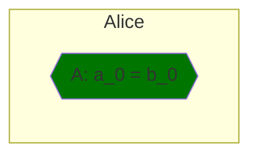
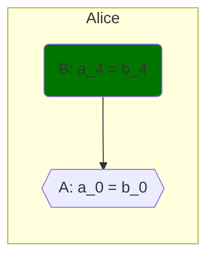
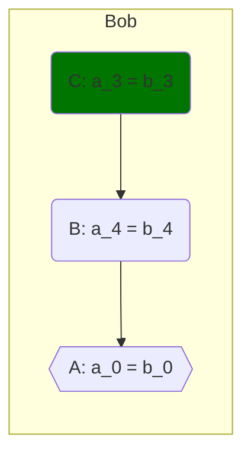
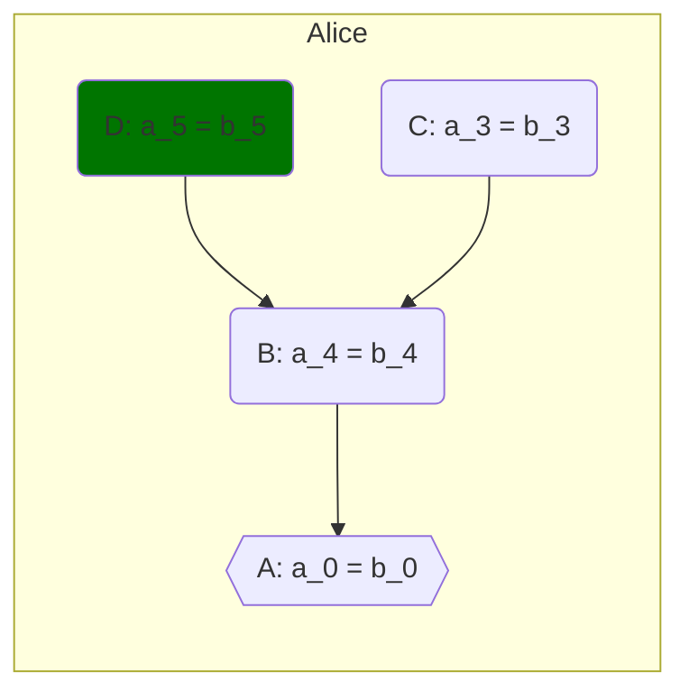
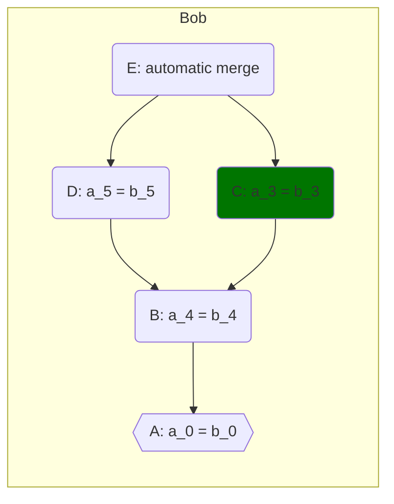
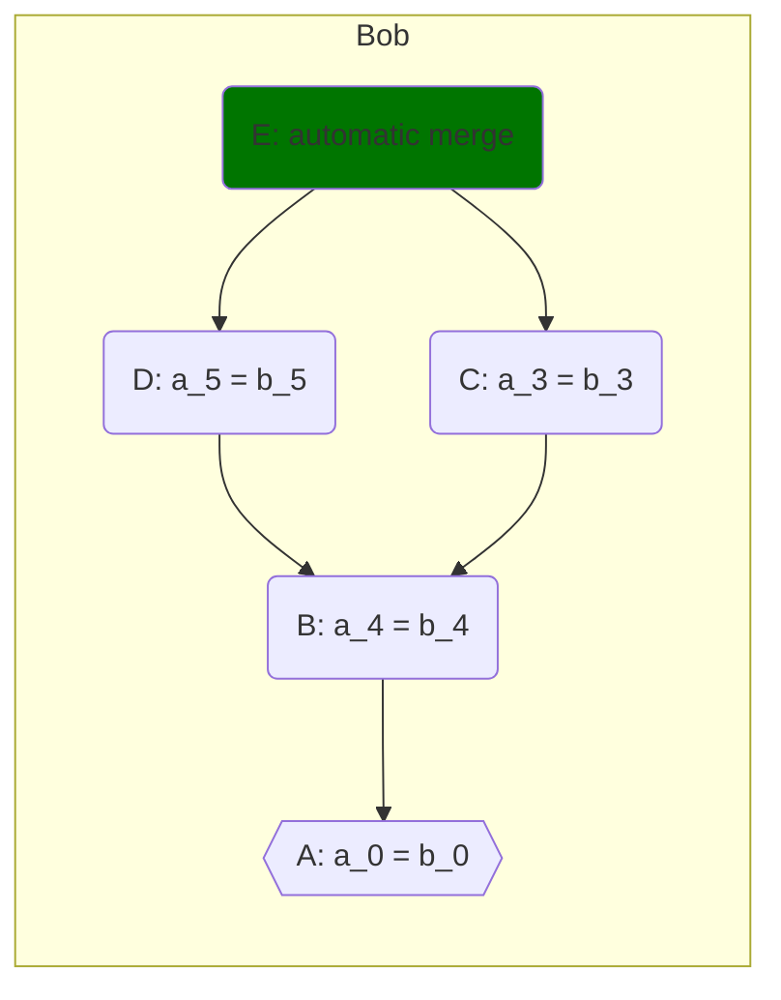
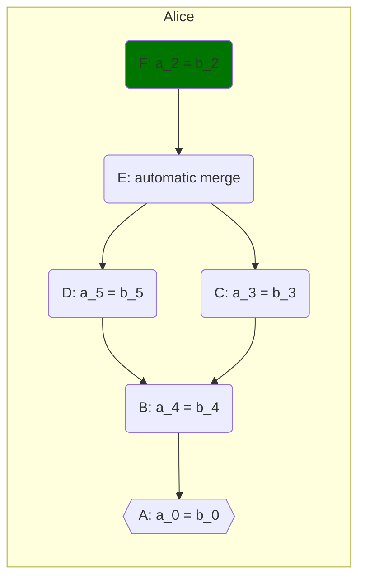
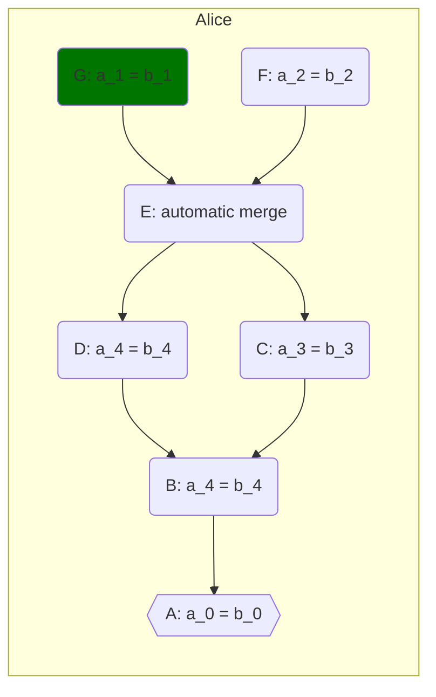
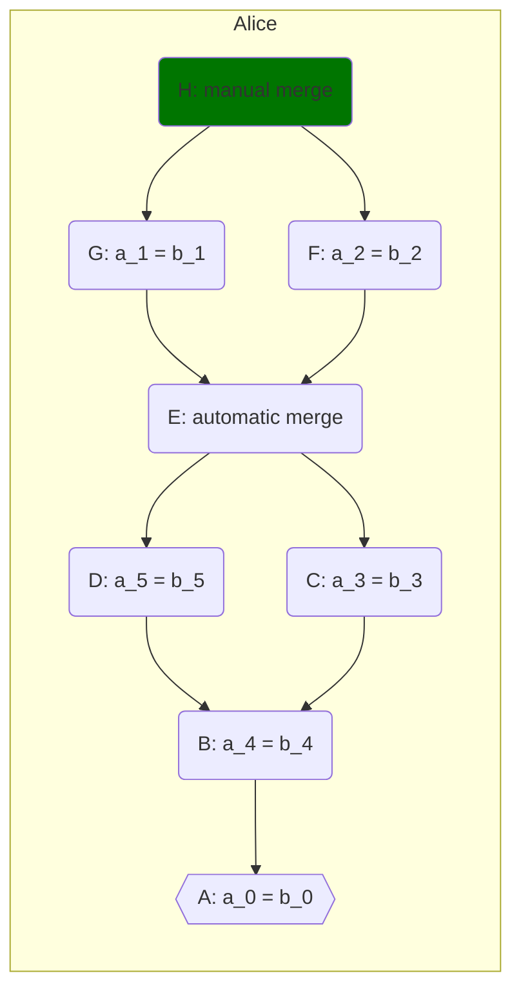

# Version control systems

Version control systems are used to track changes in collections of files. By tracking changes the version control systems provide a few important function:

- Provide information on when and how a file was changed.
- Allow the recovery of past versions of files.
- Automate partially the merging of changes when multiple versions of a file are developed concurrently, possibly by different persons.

In this short introduction to Git a small project is created to demonstrate the basic features of a version control system. First, the basic underlying model for tracking changes is introduced. Since multiple commands for performing the same function are often available in a version control tool, and the names of the commands are not always intuitive, it often helps to thing in the underlying model and the selecting the appropriate commands to performed the desired operation. A concrete example is then created in git. An interested user can follow the commands to create the repository for the demonstrative project, and perform a few operations that occur often when tracking the changes in a project with a version control tool. Finally, some details are presented on how the version control tools implement the version control model. The implementation details are not useful in daily usage, but can help in managing data saved by a version control tool, such as when stale development paths that are no longer needed need to be deleted to save space.

## The directed acyclic graph model of file history

Git stores the history of changes in a collection of of files in a collection of snapshots of the state of the files called a repository. Each snapshot is related to the snapshots that precede it, its parents. A snapshot can be preceded by multiple snapshots, for instance when changes from multiple concurrent development paths are combined in a new snapshot. The snapshots with their relation form a directed acyclic graph (DAG). A rudimentary system for storing translations for program components is now formulated to demonstrate the directed acyclic graph model of history.

Assume a simple translation systems where the translations of the strings in each program components are saved in a file. For instance, the translations for the items in the 'File' menu are saved in the file `File_menu.translation`. If the translation for the string `a_0` of some menu item is `b_0`, the line

```
a_0 = b_0
```

is added to the file `File_menu.translation`. For this model we now observe an editing session where two users, Alice and Bob, edit the file `File_menu.translation`.

Alice starts by creating the file `File_menu.translation` for the translation of the 'File' menu items, and adds the translation of a single menu item:

```
# File: File_menu.translation
# Snapshot: A (initial commit)
1. a_0 = b_0 # Line editor: Alice
```

The resulting DAG of the repository history for Alice is:



Now Alice adds the translation for one more item, resulting in a new snapshot:

```
# File: File_menu.translation
# Snapshot: B
1. a_0 = b_0
2. a_4 = b_4 # Line editor: Alice
```

The resulting DAG is:



Now a new use Bob fetches the repository and adds the translation of a menu item:

```
# File: File_menu.translation
# Snapshot: C
1. a_0 = b_0
2. a_3 = b_3 # Line editor: Bob
3. a_4 = b_4
```

The resulting DAG is:



Note that the repository history is local to each repository, so the changes made by Bob are local to his repository only. Thus, when Alice adds the translation of another term, the contents of the file in her local repository are:

```
# File: File_menu.translation
# Snapshot: D
1. a_0 = b_0
2. a_4 = b_4
3. a_5 = b_5 # Line editor: Alice
```

The resulting DAG for the repository of Alice is:


The changes stored in a repository can be inserted in another repository; this operation is called fetch. So if Alice fetches the changes made by Bob, the resulting DAG for the repository of Alice is:



Note that the contents of `File_menu.translation` in the repository of Alice have not changed. The changes made by Bob are stored in snapshot `C` whereas the state of the repository of Alice is still the snapshot `D` which is shaded.

Bob has made a change in line 2, where as Alice has made a change in line 3 of the file `File_menu.translation`. The version control software is able to detect that different lines where edited, and can automatically merge the changes in the file in a new snapshot by calling an appropriate merge command. The resulting file contents are:

```
# File: File_menu.translation
# Editor (automatic merge): Alice
# Snapshot: E (automatically merged changes)
1. a_0 = b_0
2. a_3 = b_3
3. a_4 = b_4
4. a_5 = b_5
```

The DAG of Alice's repository after the merge is:


Then Bob fetches the changes in the repository of Alice following the merge,



and proceeds to update the repository state to the latest snapshot:



Now Alice adds the translation of one more item:

```
# File: File_menu.translation
# Snapshot: F
1. a_0 = b_0
2. a_2 = b_2 # Line editor: Alice
3. a_3 = b_3
4. a_4 = b_4
5. a_5 = b_5
```

The resulting DAG is:



Concurrently, Bob adds the translation of a another item:

```
# File: File_menu.translation
# Snapshot: G
1. a_0 = b_0
2. a_1 = b_1 # Line editor: Bob
3. a_3 = b_3
4. a_4 = b_4
5. a_5 = b_5
```

The resulting DAG is:


Alice fetches again the changes made by Bob, resulting in the following DAG:



Both Alice and Bob have made a change in line 2. Version control software is typically not able to automatically merge the changes if both change sets modify the same line. Thus, a merge can be performed only if the user must manually resolves the conflict. Since in this case the two change sets are modifying a different menu entry, Alice opts to maintain both lines in the merge:

```
# File: File_menu.translation
# Editor (manual merge): Alice
# Changeset: H
1. a_0 = b_0
2. a_1 = b_1
3. a_2 = b_2
4. a_3 = b_3
5. a_4 = b_4
6. a_5 = b_5
```

The DAG of the repository is now:



## Using Git

The interaction with the version control system presented above are now concretely recreated with a couple of git repositories. Before starting, ensure that git is installed in your system. For Debian based distributions you can run:

```bash
$ sudo apt update
$ sudo apt install git
```

It is advisable that some global user options for Git are initialized immediately after installing Git (otherwise Git will prompt the user in the first relevant interaction). The main options are:

* user name, and
* user email.

Set these options up with following commands:

```bash
$ git config --global user.name "John Doe"
$ git config --global user.email johndoe@example.com
```

### Repository creation

To start tracking the history of changes in a set of files with Git, all the file are put in a directory and the initialization command `git init` is run from within the directory. For instance, a repository for the translation project demonstration is created in the directory `program_translation` with the following command:

```bash
$ mkdir program_translation
$ cd program_transation
$ git init
```

A repository with no files can be initialized directly with the command

```bash
$ git init program_translation
```

After running these commands, the directory  `program_translation` contains a hidden directory `.git` with the files that GIt uses to track the changes in the files of the repository.

### Changesets creation

Assume that Alice has created an empty project repository `program_translation`. Then, in the project directory Alice creates a new file for the translation of the entities of the 'File' menu:

```bash
$ echo 'a_0 = a_1' > File_menu.translation 
```

To add the file to the repository, the file is first added to the staging area:

```bash
$ git add File_menu.translation
```

The staging area is a feature of Git not universal to all version control tools (for instance in Mercurial there is no staging area). The staging area is helpful in handling large commits with smaller operations, as for instance when committing only some of the changes in a file (`git add --patch <file name>`).

To commit the files in the staging area call:

```bash
$ git commit
```

An editor will open; add an appropriate message describing the changes, save the file, and close the editor. The changes are now commited in the repository.

### Exchanging changesets with other repositories

## Creating online repositories

To facilitate the interaction between users, online bare repositories are often used. Websites such as Github, Gitlab, and Bitbucket allow the creation of online Git bare repositories, and offer other related services, such as comments, tickets, and access control for the repository.

## _Sources_

1. [The Missing Semester of Your CS Education: Version Control (Git)](https://missing.csail.mit.edu/2020/version-control/)
2. [Git - Git Configuration](https://git-scm.com/book/en/v2/Customizing-Git-Git-Configuration)
